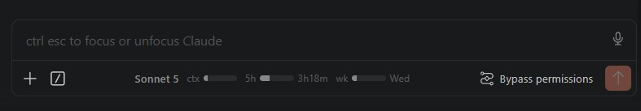

# vsce-claude-clarity

Puts the current model, context usage, and rate limits in the Claude Code VS Code extension's input row.

<p align="center"></p>

- **ctx** — context tokens against the model's real usable window, orange past 90%
- **5h** — session rate limit, with time until reset
- **wk** — weekly rate limit, with reset day

Hover any bar for exact numbers.

## Install

```
node apply.mjs
```

Then `Developer: Reload Window`. It patches the installed extension's webview bundle in place — **extension updates remove it, so rerun after each update.**

## Uninstall

```
node apply.mjs --remove
```
